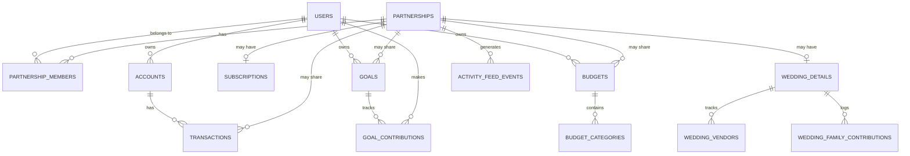

# Noivos — Database Architecture

**Status:** Draft v1.0 — awaiting founder sign-off
**Phase:** 5 of the Documentation Roadmap (see `docs/README.md`)
**Last updated:** 2026-08-02
**Source of truth precedence:** Downstream of the PRD (`docs/02 Product Requirements/PRD.md`) for product behavior and `PROJECT_MEMORY.md` for approved decisions. This document turns both into an actual PostgreSQL schema (via Supabase). No migrations have been written yet — see §12.

> Four schema-shaping questions were put to the founder directly before drafting, since they'd otherwise get silently decided in a migration file: data retention/deletion policy, balance-history strategy, audit-logging rigor for V1, and how family contributions are modeled. All four confirmed with the recommended option — see §8, §9, §10, §5.4.

---

## 1. Design Principles

1. **Privacy is enforced by the database, not the application.** Per the PRD's Privacy Philosophy (§15): "personal data is never visible to a partner unless explicitly shared, enforced at the data-access layer, not just hidden in the UI." Postgres Row-Level Security (RLS) — native to Supabase — is the mechanism. Every table holding personal-or-shared data carries an `owner_id` and, when applicable, a `partnership_id` + `is_shared` flag, and RLS policies are the actual gate, not application code that could have a bug. See §6.
2. **One active Partnership per user, enforced at the database, not just the application.** The PRD's Relationship Lifecycle (§10) requires exactly one active Partnership at a time — this is a partial unique index, not just a UI rule.
3. **Nothing about a disconnected Partnership is ever deleted or silently mutated.** It freezes. See §7.
4. **UUID primary keys throughout** (Postgres `gen_random_uuid()`), Supabase's standard default — not a founder decision, an engineering default.
5. **Soft-delete over hard-delete**, except where the founder's confirmed deletion policy (§8) calls for an actual purge on request.
6. **jsonb for genuinely variable payloads** (AI insight details, money-meeting agendas, activity-feed event data) rather than a rigid column per possible field — these are read far more than queried/filtered, so schema flexibility wins over strict typing there.

## 2. Core Entity Overview



*(Simplified — full table list is in §5. AI, notifications, challenges, and attachments are omitted from the diagram for readability but detailed below.)*

## 3. Identity & Partnership

### 3.1 `users`
Extends Supabase's `auth.users` with product-specific profile fields: `display_name`, `avatar_url`, `appearance_mode_preference` (dark/light/system — default dark per UX/UI Blueprint §2), `deleted_at` (soft delete, nullable — set on an account-deletion request per §8).

### 3.2 `partnerships`
`id`, `status` (`invited` / `active` / `disconnected`), `wedding_mode_active` (bool), `wedding_mode_graduated_at` (nullable), `disconnected_at` (nullable), `disconnected_by` (FK to `users`, nullable — who initiated).

### 3.3 `partnership_members`
Join table, one row per user per Partnership they've ever belonged to — **never deleted**, so history is preserved even after disconnect. `partnership_id`, `user_id`, `joined_at`, `left_at` (nullable, set on disconnect).

**Constraint enforcing "one active Partnership per user" (PRD §10):**
```sql
create unique index one_active_partnership_per_user
  on partnership_members (user_id)
  where left_at is null;
```

### 3.4 `partnership_invites`
`id`, `partnership_id` (nullable — a Partnership may not exist yet at invite time), `inviter_id`, `invitee_contact` (email/phone), `invite_token`, `status` (pending/accepted/declined/expired/revoked), `expires_at`.

## 4. Financial Accounts & Transactions

### 4.1 `plaid_items`
One row per Plaid Link connection. `user_id` (the connecting individual — a Plaid Item is always personally owned, even if the resulting accounts get shared), `access_token` (**encrypted, see §9**), `institution_id`, `institution_name`, `status` (active/error/reauth_required), `last_synced_at`.

### 4.2 `accounts`
`id`, `owner_id`, `partnership_id` (nullable), `is_shared` (bool — explicit flag, not inferred from `partnership_id` being set, since sharing can be revoked independently per PRD §11 edge case), `plaid_item_id` (nullable — null for manual accounts), `plaid_account_id` (external, nullable), `account_type` (checking/savings/credit_card/loan/manual), `institution_name`, `display_name`, `current_balance`, `is_manual`, `archived_at` (nullable).

### 4.3 `account_balance_snapshots` — confirmed 2026-08-02
Daily snapshots from V1, not deferred. `account_id`, `balance`, `snapshot_date`, unique on `(account_id, snapshot_date)`. This directly feeds AI Insights like "emergency fund ahead of schedule" and "savings streak" (PRD §12.11), which need real historical trend data that Plaid cannot retroactively backfill — capturing it from day one was the explicit reasoning for this choice.

### 4.4 `transactions`
`id`, `account_id`, `owner_id` (denormalized for query/RLS convenience), `partnership_id` (nullable), `is_shared` (bool — can override the account's default sharing at the transaction level, per PRD §11's requirement for granular, not all-or-nothing, sharing), `plaid_transaction_id` (nullable), `amount`, `merchant_name`, `category_id`, `note`, `transaction_date`, `recurring_expense_id` (nullable FK), `receipt_attachment_id` (nullable), `deleted_at` (soft delete).

### 4.5 `categories`
`id`, `owner_id` or `partnership_id` (whichever scope), `name`, `icon`, `is_default` (system-provided vs. user-custom).

### 4.6 `recurring_expenses`
`id`, `owner_id`/`partnership_id`, `category_id`, `amount`, `frequency`, `next_due_date`, `last_amount_seen` (compared on each sync to detect a price increase — feeds the AI Insights edge case in PRD §12.5), `is_shared`.

## 5. Budgets & Goals

### 5.1 `budgets`
`id`, `owner_id` or `partnership_id`, `is_shared`, `month` (first-of-month date), `rollover_enabled`.

### 5.2 `budget_categories`
`id`, `budget_id`, `category_id`, `planned_amount`, `rollover_amount`.

### 5.3 `goals`
`id`, `owner_id` or `partnership_id`, `is_shared`, `goal_type` (wedding/house/vacation/emergency_fund/vehicle/baby/debt_payoff/retirement/custom), `name`, `target_amount`, `target_date` (nullable), `status` (active/completed/archived).

### 5.4 `goal_contributions`
`id`, `goal_id`, `contributor_id` (FK to `users`), `amount`, `contribution_date`, `source` (manual/linked_transaction), `note`. This is what makes the UX Blueprint's stacked, per-partner-attributed progress bar (§7) possible, and what stays individually attributable if a Partnership later disconnects (PRD §10 edge case).

**Wedding Mode's family contributions are a separate, simpler table** — confirmed 2026-08-02: a plain ledger line (`wedding_family_contributions`, §5.4 below in the Wedding Mode section), not a structured contributor entity with contact info, since the PRD is explicit that family members never get product access or an implied account.

## 6. Wedding Mode

Wedding Mode is a thin extension layer on top of Goals/Budgets, not a duplicate system — the wedding budget is a `budgets` row and the wedding fund is a `goals` row of `goal_type = 'wedding'`. `wedding_details` holds only what's wedding-specific.

### 6.1 `wedding_details`
`id`, `partnership_id` (unique — one per Partnership), `wedding_date` (nullable), `guest_count_estimate`, `status` (active/graduated/paused_or_cancelled — the non-celebratory exit path from UX Blueprint §7), `graduated_at` (nullable).

### 6.2 `wedding_vendors`
`id`, `wedding_details_id`, `name`, `category`, `contract_amount`, `deposit_amount`, `deposit_paid_at`, `balance_due`, `balance_due_date`, `status`.

### 6.3 `wedding_family_contributions` — confirmed 2026-08-02
`id`, `wedding_details_id`, `contributor_name` (free text — no linked user, no login implied), `amount`, `note`, `recorded_by` (FK to `users` — which partner logged it).

### 6.4 `wedding_checklist_items`
`id`, `wedding_details_id`, `title`, `due_date`, `is_complete`, `assigned_to` (nullable — either partner, free-form since either could own a task).

## 7. AI & Engagement

### 7.1 `ai_conversations` / `ai_messages`
Threads for AI Purchase Advisor and AI Financial Coach (PRD §12.9–12.10). `ai_conversations`: `initiated_by`, `partnership_id` (nullable — a conversation can be solo/personal in context), `conversation_type`, `is_shared_to_activity_feed`. `ai_messages`: `conversation_id`, `role` (user/assistant), `content`, `input_mode` (text/voice/photo/receipt_scan/price_tag_scan), `attachment_id` (nullable).

**Privacy-critical constraint, not just a schema note:** when an AI conversation happens in a Partnership context, the context assembled for the model must only draw on data both partners (or the initiating partner, for personal-scope questions) are actually permitted to see. This is enforced by querying through the same RLS-protected views the rest of the app uses — the AI service must never use a service-role key that bypasses RLS to "see everything" when building context. This is flagged here because it's an easy mistake to make in Phase 6/8 (Backend/AI Architecture) and would silently violate the entire Privacy Philosophy if missed.

### 7.2 `ai_insights`
`id`, `owner_id` or `partnership_id`, `insight_type`, `payload` (jsonb), `is_shared` (must match the underlying data's visibility — an insight about a personal account can never be marked shared), `dismissed_at`.

### 7.3 `money_meetings`
`id`, `partnership_id`, `week_of`, `agenda` (jsonb), `status` (pending/completed/skipped), `completed_at`, `summary_notes`.

### 7.4 `activity_feed_events`
`id`, `partnership_id`, `actor_id`, `event_type`, `payload` (jsonb). By construction this table only ever contains events derived from already-shared data — the write path, not a read-time filter, is what must enforce this (see §6 RLS notes).

### 7.5 `notifications`
`id`, `recipient_id`, `notification_type`, `payload` (jsonb — generated per-recipient respecting that recipient's actual visibility permissions, per the PRD §12.14 edge case), `read_at`.

### 7.6 `challenges` / `challenge_participations`
`challenges`: `id`, `name`, `type`, `description`, `duration`. `challenge_participations`: `id`, `challenge_id`, `partnership_id` or `user_id`, `progress_percent` (relative only — **raw dollar amounts are never stored on a participation row visible to other community members**, per PRD §12.13's anti-comparison requirement), `completed_at`.

## 8. Billing

### 8.1 `subscriptions`
`id`, `partnership_id` (required — Premium is billed per Partnership per `PROJECT_MEMORY.md` §4, and the trial is invite-gated so a Partnership always exists before a subscription can), `payer_user_id`, `billing_route` (stripe_web/apple_iap/google_play — reflecting the confirmed web-first rollout), `external_subscription_id`, `status` (trialing/active/past_due/canceled), `trial_ends_at`, `current_period_end`. Full entitlement-reconciliation logic across billing routes is Backend Architecture's job (Phase 6) — this table is the record it reconciles against.

## 9. Attachments

`attachments`: `id`, `owner_id`, `storage_path` (Supabase Storage), `attachment_type` (receipt/avatar/vendor_contract).

## 10. Row-Level Security Strategy

This is the concrete mechanism behind "privacy is structural, not a policy" (PRD §15). Every table with `owner_id`/`partnership_id`/`is_shared` gets a policy following this shape (illustrative, not final SQL):

```sql
create policy "select own or shared" on transactions
  for select using (
    owner_id = auth.uid()
    or (is_shared and partnership_id = current_active_partnership_id(auth.uid()))
  );
```

`current_active_partnership_id(uid)` is a small helper function (one Postgres function, used everywhere) returning the caller's currently-active Partnership, sourced from `partnership_members` where `left_at is null`. Centralizing it in one function means the "one active Partnership" rule and the RLS policies can never drift out of sync with each other.

**Critically: the AI service, background jobs, and any admin tooling must connect using the same RLS-respecting role as the app — never Supabase's service-role key for anything that touches user financial data** — a service-role connection bypasses RLS entirely, which would quietly undo every privacy guarantee in this document. This should be a hard rule carried into Backend Architecture (Phase 6) and Security Architecture (Phase 9).

## 11. Partnership Disconnect Mechanics

Concrete answer to the "frozen, read-only" requirement confirmed in `PROJECT_MEMORY.md` §4:

1. On disconnect: `partnerships.status` → `disconnected`, `disconnected_at` and `disconnected_by` set; both members' `partnership_members.left_at` set.
2. RLS policies check `partnerships.status`: if `disconnected`, **no INSERT/UPDATE/DELETE is permitted on that Partnership's shared rows by either former member** — the workspace is frozen for both sides equally, not just the non-initiator, since there is no longer a live shared workspace to mutate at all.
3. SELECT remains available to both former members indefinitely (per the confirmed retention policy, §12) — each can still look back at shared history they had a stake in.
4. Personal data (accounts, transactions, goals owned outright by one user) is entirely unaffected — it was never gated by Partnership status in the first place.
5. A new Partnership gets a new `partnerships.id`; because old rows are never deleted or reused, there is no code path by which a new partner's queries could ever resolve to the prior Partnership's data.

## 12. Data Retention & Deletion — confirmed 2026-08-02

**Shared data from a disconnected Partnership is retained indefinitely as a keepsake, not auto-purged.** This satisfies CCPA/GDPR-style right-to-delete expectations because deletion is request-driven, not because data disappears on a timer. On an explicit account-deletion request:

- Recommend a **30-day soft-delete grace period** (`users.deleted_at` set immediately, a scheduled job hard-deletes after 30 days) rather than instant, irreversible deletion — protects against accidental or coerced deletion requests (a real scenario in a couples product, e.g. during a difficult breakup) while still honoring the request. **This grace-period detail wasn't explicitly asked as one of the four pre-drafting questions — flagging it as a recommendation, not yet founder-confirmed.**
- Hard-deletion cascades the requesting user's personal data. Shared data the *other* partner still has a stake in (their view of shared history) is not deleted just because one partner deletes their account — the other partner's frozen read-only view (§11) persists, with the deleted user's identity anonymized in that view rather than the row disappearing.

## 13. Audit Logging — confirmed 2026-08-02

**Lightweight for V1:** every table gets standard `created_at`/`updated_at` (via a shared trigger) and soft-delete columns where applicable — no dedicated audit-log table capturing full before/after diffs yet. A full audit trail is explicitly deferred to Security Architecture (Phase 9), once compliance requirements (SOC 2 timeline, etc. — still unscheduled per `PROJECT_MEMORY.md` §9) are properly scoped, rather than building it speculatively now.

## 14. Encryption & Sensitive Data

Plaid `access_token` values (and any other credential-grade secrets) must never sit in plaintext in `plaid_items`. Recommend **Supabase Vault** (built on `pgsodium`, native to the already-chosen Supabase stack) rather than introducing a separate secrets-management service — encrypts at the column level with keys the application never directly handles. This is a technical recommendation, not one of the four founder questions; flagged here for visibility rather than silently assumed, and revisited in full during Security Architecture (Phase 9).

## 15. What Happens Next (Not Part of This Document)

Consistent with `PROJECT_MEMORY.md` Rule 1 — this is still documentation. Follow-on work once approved:
1. Actual Supabase migrations implementing §3–§9's tables and §10's RLS policies.
2. The `current_active_partnership_id()` helper function and its test coverage.
3. A scheduled job for the 30-day account-deletion purge (§12), once that recommendation is confirmed.
4. Backend Architecture (Phase 6) builds the API layer on top of this schema — including the entitlement-reconciliation logic referenced in §8.

## 16. Open Items Carried to Later Phases

- **30-day deletion grace period (§12)** is a recommendation, not yet explicitly founder-confirmed the way the four pre-drafting questions were.
- **Supabase Vault for Plaid token encryption (§14)** is a technical recommendation pending Security Architecture (Phase 9) review.
- Full audit-log table design is deferred to Phase 9 per the founder's confirmed V1 scope (§13).
- Exact column types/constraints (varchar lengths, decimal precision for currency) are implementation detail for the actual migration files, not re-litigated here.

---

*Next step per the Documentation Roadmap: await founder review and approval of this Database Architecture, including the two flagged recommendations (§12 grace period, §14 encryption approach). Once approved, record it in `PROJECT_MEMORY.md` §6 and proceed to Phase 6 — Backend Architecture, which defines the API/service layer, Plaid sync jobs, and the entitlement-reconciliation logic this schema supports.*
