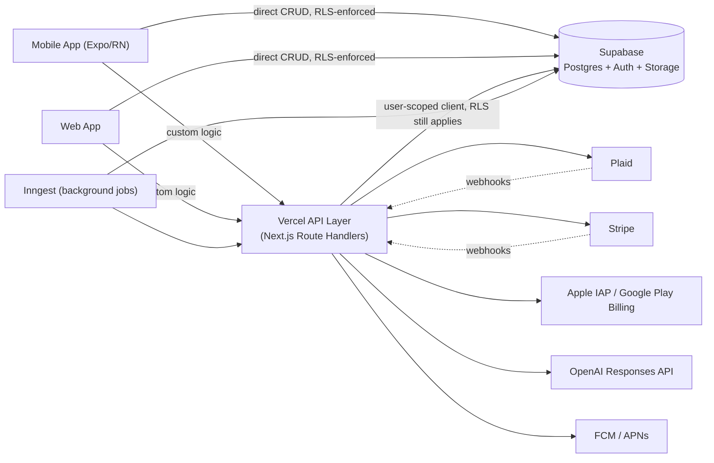

# Noivos — Backend Architecture

**Status:** Draft v1.0 — awaiting founder sign-off
**Phase:** 6 of the (re-sequenced) Documentation Roadmap (see `docs/README.md`)
**Last updated:** 2026-08-02
**Source of truth precedence:** Downstream of the Database Architecture (`docs/04 Database/Database Architecture.md`) for schema/RLS and the PRD for product behavior. This document defines the service layer sitting on top of that schema. No code has been written yet — see §12.

> Three topology questions were put to the founder before drafting: where custom backend logic lives, how Plaid sync works, and how background jobs are scheduled. The founder chose a **Vercel API layer alongside Supabase** (not Supabase-only), **webhook + reconciliation-poll** for Plaid (the recommended option), and a **dedicated job/queue service** rather than Supabase's built-in `pg_cron` — all three shape everything below.

---

## 1. System Topology

**Confirmed 2026-08-02:** custom backend logic (Plaid webhooks, billing entitlement reconciliation, AI orchestration, notification dispatch) lives in a **Vercel-hosted API layer** (Next.js Route Handlers), not in Supabase Edge Functions — Supabase itself stays scoped to Postgres, Auth, and Storage. Background/scheduled work runs in a **dedicated job/queue service (Inngest)** rather than Supabase's `pg_cron`, since Vercel's serverless functions aren't built for long-running or complex retryable workflows and Inngest integrates natively with that model.

**Design recommendation (not one of the three founder questions — flagged for confirmation):** clients talk to Supabase **directly** (via the Supabase client SDK, protected entirely by the RLS policies from Database Architecture §10) for straightforward CRUD — reading/writing personal expenses, viewing budgets/goals, etc. The Vercel API layer is reserved for anything needing a secret, a third-party call, or cross-cutting logic a client shouldn't perform unsupervised (Plaid, billing, AI, notifications, cross-Partnership writes like activity-feed events). Routing *everything* through Vercel was considered and rejected here as unnecessary duplication — RLS already is the security boundary per Database Architecture §1, so there's no security reason to proxy simple reads/writes through an extra hop.

## 2. Authentication & Authorization

- Supabase Auth issues the JWT (Email/Apple/Google, per PRD §12.1).
- Direct client→Supabase calls carry that JWT natively; RLS policies (Database Architecture §10) evaluate `auth.uid()` against it — no additional backend involvement needed.
- Calls into the Vercel API layer carry the same JWT (as a bearer token); the API layer creates a **user-scoped Supabase client** using that JWT — so even backend-mediated requests still go through RLS, not around it. This preserves the Database Architecture §10 rule ("privacy is enforced by the database, not the application") even for logic that happens to run through the API layer.
- **The one legitimate exception:** asynchronous, system-initiated writes with no live user session — a Plaid webhook arriving out-of-band, a scheduled job writing a balance snapshot. These have no user JWT to scope a client to, so they use a narrowly-scoped service credential. **Hard rule carried over from Database Architecture §10:** even here, the code must explicitly set `owner_id`/`partnership_id`/`is_shared` correctly and replicate the same ownership/sharing logic RLS would have enforced — bypassing RLS out of necessity never means bypassing the *rules* RLS encodes.

## 3. Plaid Integration

**Confirmed 2026-08-02: webhook-driven with a daily reconciliation poll as backup.**

1. **Link & Item creation:** client requests a Link token from the Vercel API (`POST /api/plaid/link-token`), completes Plaid Link, then exchanges the resulting public token server-side (`POST /api/plaid/exchange`) — the `access_token` never touches the client, and is written to `plaid_items` encrypted (Database Architecture §14, Supabase Vault).
2. **Webhooks:** Plaid pushes `TRANSACTIONS` and `ITEM` webhooks to a Vercel route (`POST /api/webhooks/plaid`). Transaction webhooks trigger a sync of new/updated transactions into `transactions`; `ITEM_LOGIN_REQUIRED` and error webhooks flip `plaid_items.status` to `reauth_required`, surfaced to the user per the calm-error-state pattern in UX/UI Blueprint §8.
3. **Reconciliation poll:** an Inngest scheduled function runs daily, re-pulling each active Item's transactions and balances as a backstop against a missed or failed webhook — this is the safety net the founder's confirmed choice was specifically about.
4. **Balance snapshots:** the same daily job writes into `account_balance_snapshots` (Database Architecture §4.3), rather than a separate job — one daily Plaid touch per account, not two.
5. **Re-auth flow:** when `plaid_items.status = reauth_required`, the client is prompted to re-open Plaid Link in update mode — no silent data staleness (PRD §12.4 edge case).

## 4. Billing & Entitlement Reconciliation

Per the confirmed web-first rollout (`PROJECT_MEMORY.md` §6): Stripe handles web checkout now; Apple IAP and Google Play Billing are added when the native mobile apps ship. All three routes write to the same `subscriptions` table (Database Architecture §8) — this is the reconciliation:

- **Stripe:** webhook (`POST /api/webhooks/stripe`) on `checkout.session.completed` / `customer.subscription.updated` / `.deleted` events updates `subscriptions.status`, `current_period_end`.
- **Apple IAP (when mobile billing ships):** App Store Server Notifications (v2) hit `POST /api/webhooks/apple`, validated and mapped to the same `subscriptions` row via `external_subscription_id`.
- **Google Play Billing (when mobile billing ships):** Real-time Developer Notifications (Pub/Sub → a Vercel endpoint) update the same table.
- **Trial gating:** the 14-day trial (confirmed in `PROJECT_MEMORY.md` §4) is only offered once a Partnership exists — the API layer checks `partnerships.status = active` before allowing a trial to start, not just client-side gating.
- A Partnership's Premium status is a single computed read (`subscriptions.status in ('trialing','active')`) regardless of which of the three routes the payer used — clients never need to know or care which billing route is active.

## 5. AI Service Boundary

Full prompt design, model selection, and conversation-management detail belong to AI Architecture (Phase 8) — this section only defines *where* AI calls happen and *how they stay privacy-safe*, since that's a backend-topology concern:

- AI Coach and Purchase Advisor requests go through the Vercel API layer (`POST /api/ai/coach`, `POST /api/ai/purchase-advisor`), never directly from client to OpenAI — this keeps the API key server-side and gives a single point to enforce the rule below.
- **The context-assembly rule from Database Architecture §6.1 applies here concretely:** the API route builds the model's context by querying Postgres through the same user-scoped, RLS-respecting client as everything else in §2 — never a service-role client "to make sure the AI has everything." If a user isn't permitted to see a piece of data through normal RLS, the AI must not be able to see it either, because it queries through the identical path.
- Streaming responses (for the chat-style AI Coach) are proxied through the Vercel route rather than the client holding a direct model connection, consistent with keeping the API key and any function-calling tools server-side.

## 6. Background Jobs (Inngest)

| Job | Trigger | Purpose |
|---|---|---|
| `plaid.reconcile` | Daily schedule | Reconciliation poll + balance snapshot (§3) |
| `money-meeting.prepare` | Weekly schedule, per active Partnership | Builds the agenda (bills, goals, purchases, topics) referenced in PRD §12.12 and UX/UI Blueprint §3.3's Home card |
| `insights.generate` | Daily schedule (or event-triggered off new transactions) | Produces `ai_insights` rows (PRD §12.11) |
| `recurring-expenses.check` | Daily schedule | Detects amount changes on recurring expenses (Database Architecture §4.6), feeding an insight when one changes |
| `subscriptions.expiry-check` | Daily schedule | Flags trials ending soon / past-due subscriptions, feeding a notification |

Inngest was chosen over Trigger.dev as the specific provider here — a lower-stakes pick than the three founder questions, both are functionally similar; flagged in §13 as swappable if the founder has a preference.

## 7. Notification Dispatch

Notification-worthy events (partner joined, goal reached, bill due, AI update, savings milestone, meeting reminder, challenge completed — PRD §12.14) are written to the `notifications` table (Database Architecture §7.5) by whichever job or API route detects them, then a lightweight dispatcher sends the actual push via FCM (Android) / APNs (iOS). **The per-recipient visibility rule from Database Architecture §7.5 is enforced at write time** — the row written to `notifications` for a given recipient must only contain what that recipient is permitted to see, since the dispatcher just sends whatever payload is already in the row.

## 8. API Conventions

- Next.js Route Handlers under `/api/*`, REST-ish resource naming, JSON in/out.
- Errors return a consistent shape (`{ error: { code, message } }`) mapped to the calm, non-technical copy patterns from UX/UI Blueprint §8 at the client layer — the API returns codes, the client owns the friendly copy.
- Versioning: not needed yet for an unreleased product with one client codebase; revisit if/when a public API or third-party integration exists.

## 9. Rate Limiting & Abuse Prevention

Baseline for V1: per-user rate limits on AI endpoints (§5) given real per-token cost, and on Plaid Link-token creation (prevents abuse of a paid third-party call). Exact limits and enforcement mechanism (Vercel middleware vs. a dedicated service) deferred to Security Architecture (Phase 9) for a fuller pass — flagged here so it isn't forgotten between now and then.

## 10. Environments

Supabase supports project branching (a branch per environment), which fits a dev → staging → production promotion path without extra tooling. Vercel deployments map naturally to the same three environments (preview deployments per branch, production on merge to main). Full CI/CD detail is Infrastructure's job (Phase 10) — noted here only because the Supabase branching capability directly affects how this backend's environments are structured.

## 11. What Happens Next (Not Part of This Document)

1. Scaffolding the actual Next.js API project and Inngest functions — first real code in this area, only after sign-off.
2. API Documentation (Phase 7) specifies every endpoint's request/response contract in full — this document defines the shape of the system, not each route's payload.
3. AI Architecture (Phase 8) defines what actually happens inside `/api/ai/*` — prompts, model parameters, function-calling tools, conversation management.
4. Security Architecture (Phase 9) gives rate limiting (§9) and the service-credential exception (§2) a full pass.

## 12. Open Items Carried to Later Phases

- **Direct-client-to-Supabase vs. everything-through-Vercel** (§1) is a design recommendation, not one of the three founder-confirmed questions — flag if a single consistent API surface is preferred over the hybrid.
- **Inngest vs. Trigger.dev** (§6) — Inngest picked as a reasonable default; swappable, lower stakes than the three founder questions.
- Rate-limit specifics (§9) and CI/CD promotion mechanics (§10) are placeholders for Phases 9 and 10 respectively.

---

*Next step per the Documentation Roadmap: await founder review and approval, then proceed to Phase 7 — API Documentation, which specifies every endpoint referenced here (`/api/plaid/*`, `/api/webhooks/*`, `/api/ai/*`) in full request/response detail.*
